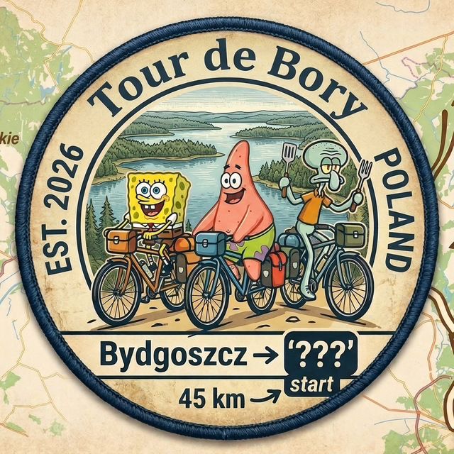

5-дневный велотуринг со стационарной базой в лесу. Регион: **Bory Tucholskie**, ~50 км к северу от **Быдгоща (Bydgoszcz)**, Польша.

## Содержание

1. [Расписание (🚧 work in progress)](schedule.md) — расписание по дням, волны приезда, дежурные бригады
2. [Участники](members.md) — сводка по участникам (формат питания, даты, палатки, транспорт)
3. [Логистика](logistics.md) — Bory Tucholskie, транспорт, вода, мусор, 112, клещи
4. [Личный чеклист](gear-personal.md) — личный чеклист + координация по палаткам
5. [Лагерное имущество](gear-camp.md) — лагерное имущество машиной (палатки — клич и координация, не онлайн-заказ)
6. [Меню (🚧 work in progress)](menu.md) — **завтраки и ужины** общей кухни 
7. [Список покупок (🚧 work in progress)](shopping-grocery.md) — закупка в продуктовом
8. [Заказы онлайн](shopping-online.md) — заказы на Allegro/Olx
9. [Общая касса](expenses.md) — факт общей кассы (PLN; инфраструктура лагеря **÷ 25 чел**)
10. [To-do (🚧 work in progress)](todo.md) — задачи 
11. [Шрёдингеры](schrodingers.md) — резерв «может быть» (Женя, Лера, Лёша), сценарии +2/+3 поверх базы

## Даты и ключевые точки

- **1–5 мая 2026** (пт–вт)
- Д1 = **1 мая 2026, пт** — выезд из Варшавы/Вроцлава → Быдгощ → лагерь. **Święto Pracy, выходной, магазины в основном закрыты** → все закупки до отъезда или в Быдгоще до поезда
- Д2 = **2 мая 2026, сб** — поездка 1. **дозакупка** 
- Д3 = **3 мая 2026, вс** — поездка 2. **Święto Konstytucji + воскресенье, магазины закрыты** 
- Д4 = **4 мая 2026, пн** — поездка 3; **дозакупка**
- Д5 = **5 мая 2026, вт** — сборка лагеря, выезд, поезд домой

## Состав (из [CSV участников](members.csv))

Зарегистрировано **25 человек**. Подробности — [Участники](members.md).

> **Шрёдингеры (+3)** — Женя, Лера, Лёша — учтены отдельно в [Шрёдингеры](schrodingers.md) и в счётчик 25 **не входят**. Базовые цифры ниже считаем без них; сценарная дельта — в конце таблицы и в [Шрёдингеры](schrodingers.md).

### По формату питания

- **Общая кухня** (пик **19** чел): **Д1 ужин — Д3 завтрак** на **19** чел (**17** всеядных + Танюша + liza). **Д3 ужин, Д4 завтрак и Д4 ужин** — на **16** чел (**14** всеядных + Танюша + liza). **Д5 завтрак** — **14** чел (**12** всеядных + Танюша + liza). См. [Меню](menu.md), отличия от анкеты — [Ручные правки](hardcoded_diff.md).
  `@dashananas, антон, ЛЮДА, Танюша (вегетарианец), @uncleingi1, Данте, @danilchuk4, Залата, Лолита, supersonic, @pinkcum, Георгий, WineDoll, Влад Синица (до вечера Д3), Dron, liza (веган), Elijahby, Катя, Julia`
- **Сами везут еду** (6 чел, в общей кухне не участвуют, но пользуются общей водой/тентами/костром):
  `Федор, Юра, счь, Полина, Саня, ar53n1`

### По срокам пребывания (для закупки по дням)

| День | В лагере (все) | Общая кухня | Всеядные | Вегетарианец | Веган |
|---|---|---|---|---|---|
| Д1 1 мая | 24 | **19** | 17 | 1 | 1 |
| Д2 2 мая | 24 | **19** | 17 | 1 | 1 |
| Д3 3 мая | 25 | **19** (завтрак) / **16** (ужин) | 17 / 14 | 1 | 1 |
| Д4 4 мая | 20 | **16** | 14 | 1 | 1 |
| Д5 5 мая | 18 | **14** | 12 | 1 | 1 |

Неопределённые (`@danilchuk4, Dron`, плюс liza по срокам): в расчёте считаем «до 5е» — есть буфер на случай раннего отъезда.

### Сценарий «шрёдингеры» (поверх базы, см. [Шрёдингеры](schrodingers.md))

- **S1 «+2» Д1–Д3:** Женя + Лера (вегетарианцы) → общая кухня **21**, вегетарианцев **3** (Танюша + Женя + Лера), всеядных **17**, веган **1**.
- **S2 «+3» Д1–Д5:** S1 + Лёша (всеядный) → общая кухня **до 22** на пике, **+1 всеядный** на Д4–Д5 (**17/15** вместо **16/14** при базе ниже).
- Решение — **до T-7 (24 апреля)**. Закупка и вода пересчитываются из [Шрёдингеры](schrodingers.md) только при подтверждении.

### Без палатки, ищут подселение (6 чел)

`@dashananas, ЛЮДА, Лолита, WineDoll, Dron, Elijahby`

### Свободные места в палатках (11 мест)

`Юра (1), Георгий (1, только до вечера Д3), Julia (1), Антон (4, доп. 4-местка), Злата (4, доп. 4-местка)`

**Баланс закрыт, профицит ~5 мест.** Черновое распределение — см. [Участники](members.md).

## Ключевые ограничения

- **Польские праздники 1 и 3 мая:** магазины закрыты. Основная закупка — в Варшаве/Вроцлаве. **Суббота 2 мая** — ближайший магазин ~8 км от лагеря (см. [Логистика](logistics.md)); **понедельник 4 мая** — дозакупка
- **Воскресенье 3 мая — двойной выходной** (запрет на воскресную торговлю + праздник). В некоторых Żabka/АЗС могут быть исключения, но не рассчитываем
- **Костры и лагерь:** точка в зоне **Zanocuj w lasie** (Lasy Państwowe) — см. GPS в [Логистика](logistics.md) § 0; костёр только в разрешённых местах, не дольше срока программы
- **Клещи в мае:** пиковый сезон. Репеллент, одежда с рукавами, проверки. Подумать о вакцинации TBE заранее (но уже поздно для полной серии)
- **Вода:** вода нужна постоянно, для всего и в больших количествах. **Обязательное пополнение 2 мая** и **4 мая** велозаездом (~8 км). См. [Логистика](logistics.md)

## Что уже есть

- Базовая кухня (ножи, доски, специи, контейнеры, мелочёвка: тёрка, открывашки, дуршлаг и т.д. — уточнить на сборе)
- 1 туристический **складной стол** (в наличии)
- 1 большой тент-палатка без дна (столовая, в полный рост)
- 1 большой натягиваемый тент (навес)
- Газовые горелки и кастрюли у участников 
- **Канистра 30 л с краном**, **стойка под мусорный мешок**, **чугунный WOK 37 cm***
- **Туристический холодильник 32L***

\* куплено онлайн 20.04, учёт — [Общая касса](expenses.md), [Лагерное имущество](gear-camp.md)

## Что пригодится
- **Мангал, шампура, зажигалки, щипцы, лопатка, перчатки для гриля, топорик, пила** 
- **Освещение** (фонари, налобники, гирлянды, power bank)
- Bluetooth-колонка, игры, развлекуха
- 
## Бюджет (грубо, только PLN)

Оценка **общей кассы** (продукты, алкоголь на группу, снаряжение, вода в магазинной фасовке). [Общая касса](expenses.md).

| Категория | zł (PLN) |
|---|---|
| Оборудование | ~500 |
| Вода (если из магазинов в канистрах) | ~300 |
| Резерв ~10% | +80 |
| **Итого порядок** | **~580** |
| **С человека** | **~23.2** |
|---|---|
| Продукты (общая кухня) | ~1600 |
| Алкоголь (общая кухня) | ~500 |
| **Итого порядок** | **~210** |
| **С человека** | **~121.5** |

