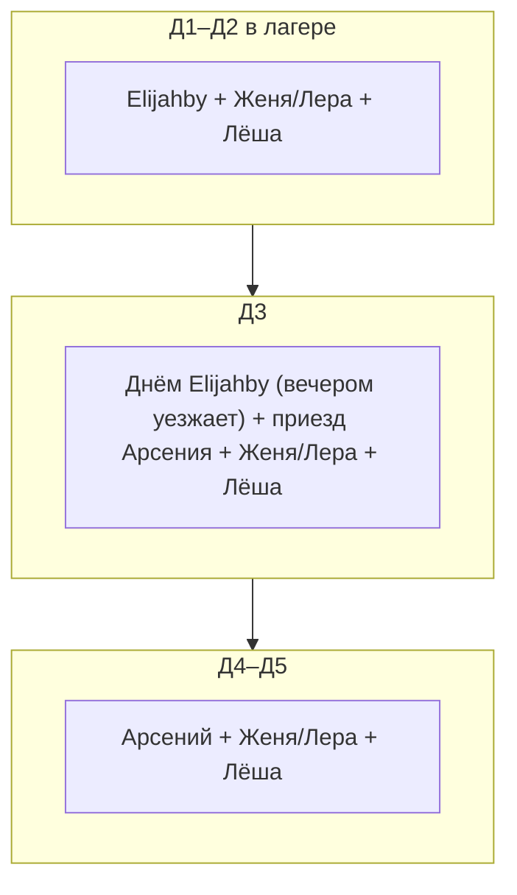

# Логистика: транспорт, вода, мусор, безопасность, план Б

Этот файл — про то, как лагерь работает **как система**. Даты — 1–5 мая 2026, место — **Bory Tucholskie** (~50 км к северу от Быдгоща, Польша).

---

## 0. Контекст места

**Bory Tucholskie** — один из крупнейших лесных массивов Польши (~1200 км²), сосны и мешаные леса, много озёр (Jezioro Charzykowskie, Jezioro Okoninek, Brda и т.д.). В регионе:

- **Park Narodowy «Bory Tucholskie»** — национальный парк (запрет лагеря/костра вне обозначенных мест)
- **Tucholski Park Krajobrazowy** — ландшафтный парк (ограничения, но более мягкие)
- **Общий лес (Lasy Państwowe)** — действуют правила Lasów Państwowych
- **Miejsca postoju** / **Miejsca biwakowe** — обозначенные стоянки и места для костра (**их нужно бронировать!** через приложение «Mój Las» или nadleśnictwo)
- **Частные агротуризмы** — фермы, сдающие поле + часто туалет + вода + иногда электричество

### Зафиксировано: место лагеря

- **GPS:** `53.48987724994465, 17.88360252594775` — зона **Zanocuj w lasie** (Lasy Państwowe). **Рядом парковка.** Для этой программы бронирование через mojlas.pl **не требуется**; действуют правила: до **2 ночей** подряд, **костёр только** в обозначенных местах (не разводить огонь где попало).
- **Ближайший магазин:** [maps.app.goo.gl/2ZYxbZ9ePUMm5T336](https://maps.app.goo.gl/2ZYxbZ9ePUMm5T336) — **~8 км** от лагеря (вода и провизия на **Д2** и **Д4**).

### Что ещё уточнить про место

- [ ] **Ближайшее nadleśnictwo** (лесничество) — телефон в экстренный случай (часто на стенде у парковки / табличке)
- [ ] **Ближайшая больница** (szpital)
- [ ] **Источник воды** рядом: озеро, река Brda/Wda, ручей, деревенская колонка? — дополнительно к закупкам

---

## 1. Машина и её роль

**Аренды нет.** Лагерь обслуживают **четыре частные машины** участников (см. [gear-camp.md](gear-camp.md), [hardcoded_diff.md](hardcoded_diff.md)).

- **Elijahby** — **Д1–Д3** (**вечером Д3** уезжает — см. [members.md](members.md)); основной груз заезда вместе с **Женей/Лерой**.
- **Женя/Лера** — **Д1–Д5**, своя машина; буфер по объёму на весь цикл (см. [schrodingers.md](schrodingers.md) — если не подтвердятся к T-7, ребалансируем груз).
- **Лёша** — **Д1–Д5**, маленькая машина: **не грузовик**, только один человек + мелочи.
- **Арсений (`ar53n1`)** — **Д3–Д5** (приезд **Д3**); обратный груз **Д5**, дозакупки/канистры **Д2 и Д4** по договорённости.

**Д1 заезд:** груз делят **Elijahby**, **Женя/Лера**, по мелочи **Лёша**. **Д5 выезд:** **Женя/Лера**, **Лёша**, **Арсений** (Elijahby **вечером Д3** уже уехал). **Д4** добор припасов — велосипеды + попутно машина **Арсения** (с **Д3** в лагере); отдельного рейса «только машина в магазин» нет.

### Вес и объём (на весь лагерь, делится между машинами)

- Вода **Д1:** **1 × 30 л ≈ 30 кг** + канистры участников (**ориентир ~30–100 кг** водой суммарно у водителей)
- Еда и напитки: ~200 кг
- Снаряжение (тенты, кулеры, кухня): ~50–100 кг
- Личный багаж части участников: +50–100 кг
- **Итого: ~300–500 кг** (часто **~400 кг**). Распределяется между **Elijahby**, **Женя/Лера** и мелочью в **Лёше**; **Арсений** подхватывает вывоз и дозакупки **Д3–Д5**. При нехватке места — чеклист загрузки и перекладка в **Женю/Леру** (больший буфер).

### Чеклист погрузки

См. [gear-camp.md](gear-camp.md) раздел «Чеклист погрузки машины». Правило: «тенты первыми вынимаются, последними грузятся на отъезд».

---

## 2. Вода — расчёт и обеспечение (25 чел)

### Норма расхода

| Цель | На 1 чел/день |
|---|---|
| Питьё в лагере | 1,5 л |
| Готовка общая | 0,8 л |
| Мытьё посуды | 0,5 л |
| Гигиена минимум | 0,5 л |
| **Итого в лагере (весь день)** | **~3,5 л/чел/день** |

Питьё на радиалках участники берут **сами** (велобутылки и т.д.) — **не входит** в общий расчёт.

### Всего на лагерь

| День | В лагере | Питьё+готовка+гигиена |
|---|---|---|
| Д1 | 24 | ~84 л |
| Д2 | 24 | ~84 л |
| Д3 | 25 | ~88 л |
| Д4 | 20 | ~70 л |
| Д5 | 18 | ~63 л |
| **Итого** | | **~390 л** |

**Итого общей воды лагеря: ~400 л** (округление).

> **Сценарий шрёдингер** ([schrodingers.md](schrodingers.md)) — поверх базы:
> - S1 «+2» (Женя/Лера, Д1–Д3): **+~25 л** (2 чел × 3,5 л × 3 дня, округление).
> - S2 «+3» (S1 + Лёша, Д1–Д5): **+~50 л** суммарно.
> - S2-max (все трое до Д5): **+~65 л**.
> Базовую цифру 400 л **не меняем** до подтверждения к T-7 (24 апреля); дополнительные канистры закладываем только при «да».

### Стратегия снабжения

Онлайн заказываем **одну** канистру **30 л с краном**; остальное — **канистры и бутыли у участников** (опрос до Д1) + бутыли из магазина. См. [shopping-online.md](shopping-online.md), [gear-camp.md](gear-camp.md).

| Источник | Количество | Когда |
|---|---|---|
| Канистра 30 л машиной Д1 | **30 л** | пт 1 мая |
| Канистры/бутыли участников Д1 | ориентир **~140–180 л** (уточнить опросом; на старте хватает до **Д2**) | пт 1 мая |
| Бутылированная 0,5/5 л из магазина | ~50–80 л (в бутылках) | Д1 |
| Пополнение **Д2** (сб 2 мая, **обязательно**) | бутыли **5 л** + перенос в канистры; магазин **~8 км** — [карта](https://maps.app.goo.gl/2ZYxbZ9ePUMm5T336) | велозаезд / попутно с радиалкой / попутная машина |
| Пополнение **Д4** (пн 4 мая) | бутыли **5 л** + перенос в канистры / дозакуп провизии | велосипеды / договорённости |
| **Итого** | **~400 л** | с запасом за счёт **Д2**, **Д4** и участников |

### Пополнение воды Д2 и Д4

**Д2 (сб, 2 мая) — обязательно:** заезд за водой в ближайший магазин (**~8 км**). Канистры везём с лагеря на велах или попутной машиной; можно совместить с маршрутом радиалки (ответвление) или отдельной ходкой.

**Д4 (пн, 4 мая) — магазины открыты.** То же: канистры с лагеря на велах (или иначе по договорённости), плюс дозакупка еды и быта по [shopping-grocery.md](shopping-grocery.md).

**В оба дня, варианты:**
- **Автоматы «живая вода» (woda źródlana)** по пути — наливаем в канистры, ~30 gr/л
- **Большие бутыли 5 л** (Żywiec Zdrój и т.п. в sklep) — переливаем в канистры или везём в бутылях
- **Колонка в деревне** (если есть питьевая) — мелкие ежедневные дозаправки вместо одного большого рейса

### Оптимизация в лагере

- Посуду мыть в 2 тазах: мыльная + чистая
- Слив — в отдельную яму (30 см), не в водоём и не под деревьями
- Гигиена — обтирание влажной тряпкой, не душ

---

## 3. Мусор — обращение и режим вывоза

**Правило №1: 100% мусора выносим из леса.** Ни бумажки, ни окурка. Лагерь после нас — чище чем до.

### Сортировка в лагере (важно для Польши — там жёсткая сортировка!)

Польская система: **5 категорий** (Papier, Szkło, Metale+Tworzywa sztuczne, Bio, Zmieszane). В лагере поддерживаем упрощённую версию:

| Категория | Куда | Вывоз куда |
|---|---|---|
| **Пищевые (bio)** | **Двойной мешок** 120 л в держателе; на ночь — тот же мешок **на дерево** (3+ м) | Municipal bio-контейнер коричневый |
| **Стекло (szkło)** | Отдельный мешок | Контейнер зелёный/белый |
| **Пластик + алюминий (tworzywa)** | Основной мешок 120 л в держателе | Контейнер жёлтый |
| **Бумага/картон (papier)** | Отдельно, сжигаем чистую в костре | Контейнер синий |
| **Общий мусор (zmieszane)** | Остаток | Контейнер серый/чёрный |
| **Санитарные (ТБ, гигиена)** | Плотно завязанный маленький мешок | В zmieszane |

### Режим вывоза

- **Каждый вечер:** пищевые отходы → на дерево на 3+ м от земли (лиса, енот, кабан в Bory Tucholskie есть!)
- **Д4 вывоз мусора:** увезти к контейнерам тем же способом, как едут за покупками/водой (велосипед с прицепом, рюкзаки, машина гостя — по плану). Цель — не тащить всё на Д5
- **Д5 машина:** остатки Д4–Д5 + санитарная зона → домой / в бак
- **Где выкидывать в польских городах:** муниципальные контейнеры PSZOK или дворовые баки. **Не заваливать один контейнер!** Распределить на несколько точек. В Tucholi/Chojnicach точно есть

### Куда не надо

- В реку/озеро/землю — даже био-пищевые отходы (привлекают зверей, портят биоценоз)
- В костёр — только чистая бумага/картон (не пластик, не фольга!)

---

## 4. Туалет и санитария

### Туалетная зона

- **50+ м от кухни и источника воды**
- **Яма 40–50 см глубины**, сверху складное туалетное сиденье (или доска с отверстием)
- **Засыпка** после каждого «захода»: землёй + листьями. Если есть извёстка (wapno) — ок
- **Экран** из тряпки между деревьями, или натяжная ширма
- **ТБ** рядом в пакете (от дождя)
- **Санитайзер** с насосом рядом с выходом
- **После Д5:** закопать яму, утоптать, присыпать сверху листвой. «Нет следа»

### Мытьё

- Мыло **биоразлагаемое** (Dr. Bronner's, Био-экологичное польское — в Rossmann, Allegro)
- **Серые воды** (после мытья посуды) — в отдельную яму 30 см, не в ручей
- Купание в озере/реке — без мыла/шампуня в воде (намылился на берегу → облился чистой водой)

### Кухонная санитария

- **Разделочные доски** — отдельные для мяса и для овощей/веган
- Мыть руки перед готовкой, после туалета, после радиалки
- Скоропорт из кулеров сразу обратно (не держим на воздухе), особенно мясо и молочку

### Костровая зона

- Отдельно от кухни и тента (2+ м)
- Окружить камнями или приямок
- **20+ л воды** рядом для тушения + лопата
- **Никогда не оставлять костёр без присмотра**
- **Ночь:** тушить полностью, угли перемешать с водой до «мокрой каши»
- В лесах Польши есть **okres zakazu palenia ognisk** — обычно вводится в сухую жаркую погоду. **Проверить** на Lasy Państwowe перед выездом

---

## 5. Безопасность и связь

### Экстренный звонок

- **112** — единый европейский экстренный номер. Работает без SIM. Говорит на польском, английском, русском часто тоже ловят
- **999** (погото́вие) — медицинская помощь
- **998** — пожарная служба

### При звонке в 112 нужно сообщить

1. Что случилось (что, кто пострадал, сколько)
2. **GPS-координаты в децимальных градусах** (напр. **53.4899, 17.8836**) — записаны на бумаге у медика!
3. Ближайший населённый пункт и nadleśnictwo
4. Телефон обратной связи

### Связь

- **Мобильная:** Bory Tucholskie — смешанное покрытие. В деревнях ок, в глуши может не быть. Проверить у оператора
- **Резерв:** рации PMR (8 каналов, бесплатно, до 5 км в лесу без помех) — 4 шт между ключевыми ролями (лидер радиалки, лагерь, медик, водитель)
- **GPS:** каждый с оффлайн-картой (OsmAnd, Maps.me, Komoot) + GPX-трек лагеря и радиалок

### Медик и безопасность

- Общая аптечка в тенте-столовой, на видном месте
- Каждый знает аллергии соседа по палатке
- **Клещи** — см. ниже, отдельная секция
- **Солнечный удар** — пить электролиты, отойти в тень
- **Обезвоживание** — контроль цвета мочи (светлая = норм)
- **Порезы при готовке** — хлоргексидин + пластырь

### Группа безопасности в радиалке

- **Лидер (вёл)** + **замыкающий (sweeper)**
- Никто не уходит вперёд лидера и не отстаёт от замыкающего
- Точки сбора каждые ~10 км или перед сложными участками
- Если кто-то сходит — едет с водителем (если машина доступна) или ждёт у дороги с контактом
- Связи нет → ждём на последней точке сбора до X часов, потом возвращаемся в лагерь

---

## 6. 🕷️ Клещи — ОТДЕЛЬНАЯ СЕКЦИЯ (это серьёзно в Польше в мае!)

**Bory Tucholskie — эндемичный район** по клещевому энцефалиту (KZM/TBE) и боррелиозу.

### Профилактика (обязательно!)

1. **Одежда:** длиннорукавные светлые футболки, длинные штаны, штаны заправлены в носки в лесу
2. **Пермитрин** на одежду за 24–72 ч до выезда (держится 3–5 стирок)
3. **DEET 30%+** на открытую кожу, обновлять каждые 4 часа
4. **Осмотры взаимные** после каждой радиалки — пах, подмышки, шея, голова, за ушами, пупок, подколенные впадины. **Обязательно** — не стесняться, это работает только если реально смотрим
5. **Душ/обтирание** сразу по возвращении — смывает клещей до того, как они впились

### Если клещ впился

1. Не давить, не мазать маслом, не поджигать
2. Извлечь **специнструментом** (hakiem / twister) вращательно
3. Сохранить клеща в банку с травинкой (живой!) — отнести на анализ в лабораторию (Bydgoszcz SANEPID или частная). Анализ PCR на KZM+Borrelia: ~100–200 zł, 2–5 дней. **Не обязательно, но даёт быстрый ответ**
4. Место укуса — хлоргексидин
5. **Наблюдение 4 недели:**
   - Появление **красного кольца** (erythema migrans) с расширением → срочно к врачу (боррелиоз)
   - Температура/гриппоподобное через 7–14 дней → срочно к врачу (KZM)

### Вакцинация против KZM (TBE)

- Польские препараты: **FSME-Immun** или **Encepur**
- Стандартная схема: 0 / 1–3 мес / 9–12 мес (полный курс)
- **Быстрая схема:** 0 / 14 дней — даёт частичную защиту
- **Консультация с врачом индивидуально** — решать срочно, пока не поздно
- Боррелиоз — вакцины нет, только профилактика

### В аптечке лагеря

Инструменты для клещей, лупа, хлоргексидин, маркер для отметки покраснений — **у медика (Злата)** в её аптечке; в общий [shopping-online.md](shopping-online.md) не входят.

---

## 7. План Б

### Сильный дождь (весь день)

- **Радиалка** сокращается или отменяется
- Большой **тент-столовая** = центр жизни (настолки, сон днём, тусовка)
- **Готовка** под натягиваемым тентом снаружи. **Газ и костёр — НИКОГДА в тенте** (угарный газ!)
- **Одежда** сушится под тентом (не на горячем)
- Д5 сборка под дождём: тенты в отдельный большой мешок мокрыми, дома сушим на верёвках

### Критическая нехватка воды

- **Вариант 1:** срочная 2-я поездка на машине (даже ломая план радиалок)
- **Вариант 2:** экстренная закупка **бутылей 5–10 л** в магазине / автомат «живая вода»; при сомнительном источнике — **кипячение**
- **Вариант 3:** сократить готовку (одно горячее блюдо в день)

### Травма / медицинская эвакуация

- Пострадавший + медик + 1 помощник → машина → szpital
- Связь по рации/телефону
- Если основной водитель эвакуируется — **заранее определить второго водителя** (кто умеет + есть права)
- 112 — вызов спасателей, можно вертолётом LPR (Lotnicze Pogotowie Ratunkowe) в тяжёлых случаях

### Технические проблемы с велосипедом

- Общий ремнабор в лагере
- Если поломка в радиалке неустранима — вел на машину (если доступна) или пешком до дороги → машина → лагерь
- Запасных велосипедов нет

### Алкогольный перебор

- **«Никаких пьяных у костра»** — отводим спать
- Вода, электролиты, на бок (рвотный рефлекс)
- Медик в курсе

### Потерявшийся человек

- **Первые 30 мин:** ждём на последней точке сбора, звоним
- **30–60 мин:** часть группы возвращается искать
- **60+ мин:** 112 с координатами

### Пожар в лесу (ОЧЕНЬ СЕРЬЁЗНО в сухую погоду!)

- **998** (straż pożarna) немедленно
- Тушим, если маленький и безопасно: водой, землёй, ветками
- Если разрастается — **эвакуация лагеря**: все собираются у машины и уезжают
- Никогда не пытаемся тушить большой пожар самостоятельно

### Неопределённые участники снялись

- Больше остатков еды — не проблема, разойдётся
- Если наоборот добавились — возможности добавления в закупку по Д4 есть

---

## 8. Экологический минимум (Leave No Trace)

1. **Планируй заранее** (этот документ — оно)
2. **Проходи по существующим тропам**
3. **Убирай весь мусор** — 100% выносим. Включая окурки, фольгу, битое стекло
4. **Оставь что нашёл** — ничего не уносим из леса
5. **Безопасность с огнём** — только в обозначенных местах
6. **Уважение к природе** — не кормить зверей, не ломать деревья, не рвать цветы
7. **Уважение к другим туристам** — не шумим ночью, не занимаем всю поляну

---

## 9. Таблица рисков

| Риск | Вероятность | Воздействие | Митигация |
|---|---|---|---|
| Дождь несколько дней | Средняя | Среднее | Большие тенты, план Б, настолки |
| Недобор воды | Средняя | Высокое | Опрос участников о канистрах/бутылях до Д1, **обязательные refill Д2 и Д4**, контроль завхоза, план Б |
| Пищевое отравление | Низкая | Высокое | Кулеры, раздельные доски мясо/овощи, мытьё рук |
| Травма на радиалке | Средняя | Высокое | Шлемы, лидер+замыкающий, связь, аптечка |
| **Клещ + KZM/боррелиоз** | **Высокая** | **Высокое** | **Пермитрин, DEET, осмотры, инструмент, вакцинация** |
| Пожар в лесу | Низкая | Очень высокое | Вода у костра, погода, полное тушение, 998 |
| Магазины закрыты в Д3 | 100% | Среднее | Дозакупку переносим на Д4 |
| Не помещается в машину | Средняя | Среднее | Чеклист загрузки, распределение между четырьмя машинами, буфер у Жени/Леры |
| Кабан/лиса в лагере ночью | Низкая | Среднее | Еда подвешена, пищевой мусор в **двойном мешке** на дереве / в закрытом держателе |
| Потерявшийся участник | Низкая | Высокое | Протокол связи, точки сбора, 112 |
| Поезд опоздал / отменён | Средняя | Низкое | Волны приезда, gibkий ужин Д1 |
| Нарушение правил Zanocuj w lasie (костёр не там, >2 ночей и т.п.) | Низкая | Среднее (вплоть до штрафа) | Огонь только в разрешённых местах, не оставаться дольше срока программы; см. § 0 |

---

## 10. Полезные контакты (вписать)

- [ ] **Водитель основной:** _@__, тел. _+48..._
- [ ] **Координатор велозаезда Д2 и Д4 (вода/магазин):** _@__, тел. _+48..._
- [ ] **Elijahby (машина Д1–Д3):** _@__, тел. _+48..._
- [ ] **Женя/Лера (машина Д1–Д5):** _@__, тел. _+48..._
- [ ] **Лёша (машина Д1–Д5, мелкий груз):** _@__, тел. _+48..._
- [ ] **Арсений / ar53n1 (машина Д3–Д5):** _@__, тел. _+48..._
- [ ] **Шеф-кухни:** _@__, тел. _+48..._
- [ ] **Медик:** _@__, тел. _+48..._
- [ ] **Ближайшее nadleśnictwo:** _название_, тел. _+48..._
- [ ] **Ближайший szpital (больница):** _название, город_, тел. _+48..._
- [ ] **Ближайшая частная клиника (быстрее):** _название_, тел. _+48..._
- [ ] **Лаборатория на клеща (SANEPID или приват):** _название, адрес в Быдгоще_, тел. _+48..._
- [ ] **112** — экстренный ЕС (работает везде)
- [x] **GPS-координаты лагеря:** **53.4899, 17.8836** (точка: 53.48987724994465, 17.88360252594775)
