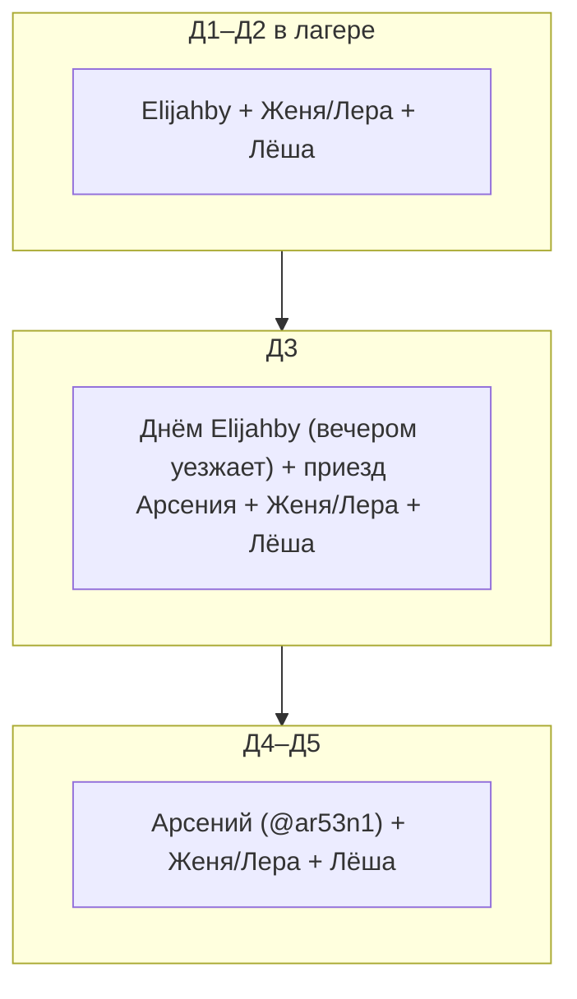

# Логистика лагеря

**Транспорт, инвентарь, вода, мусор.** Даты: **1–5 мая 2026**, регион **Bory Tucholskie** (~50 км севернее Быдгоща, Польша). Общий маршрут заезда и варианты точки — в **[route.md](route.md)**.

---

## 1. Ситуация с лагерем

**Bory Tucholskie** — крупный лесной массив; в регионе пересекаются **нацпарк**, **ландшафтный парк**, **Lasy Państwowe**, обозначенные **Miejsca postoju / biwakowe** (часто бронь через **Mój Las** / nadleśnictwo) и частные площадки.

**Три кандидата на точку** — **A**, **B**, **C** (fallback). Решение после разведки **Д1**; сравнение и GPS — в [route.md](route.md). Ниже — логистические следствия; **колонка «~8 км до магазина»** и план **Д2/Д4** откалиброваны под **C**; для **A/B** после выбора **перемерить** расстояние до sklepu и обновить маршруты дозакупки.

### Вариант **C** (fallback) — Zanocuj w lasie

- **GPS:** `53.48987724994465, 17.88360252594775` (округлённо **53.4899, 17.8836**)
- **Правила программы:** до **2 ночей** подряд; **костёр** — только в отведённых местах. Бронирование через mojlas.pl **для этой точки не требуется** (как зафиксировано на этапе планирования — проверить актуал на месте)
- **Магазин ~8 км** (вода, провизия **Д2** и **Д4**): [карта](https://maps.app.goo.gl/2ZYxbZ9ePUMm5T336)

---

## 2. Парковка и подъезд для **A / B / C**

Зафиксировать **в день разведки** (и при смене варианта): где ставим машины, как далеко таскать груз, можно ли подъехать с прицепом/развернуться.

| | **A** (Sokole–Kuźnica, кэмпинг) | **B** (берег, «дикость») | **C** (Zanocuj w lesie) |
|---|---|---|---|
| **Парковка** | _уточнить: стоянка кэмпинга / leśny parking рядом с заездом_ | _уточнить: площадка у лесной дороги, без блокировки въезда, заметность с воды/тропы_ | **Лесная стоянка у точки**; на [карте трека](route.md) в районе C видны **Parking leśny**, **wiata** — привязать к финальному заезду |
| **Подъезд** с грузом | _въезд легковой / грунт / ограничения — записать_ | _часто узкий выезд; не предполагать близкую стоянку_ | Подъезд к парковке у лесной поляны; дальше — перенос в лагерь |
| **Расстояние «машина → палатки»** | _метры / рельеф_ | _метры / рельеф_ | _метры / рельеф_ |

**Машины и разгрузка (все варианты):** кто куда грузит по дням — в §3. Под **A** и **B** подъезд, разворот и парковка **отличаются** от **C** — не копировать сценарий C вслепую.

---

## 3. Привоз и вывоз инвентаря

**Аренды нет** — **четыре** личных машины участников (см. [Лагерное имущество](gear-camp.md), [Ручные правки](hardcoded_diff.md), [Участники](members.md)).

- **Elijahby** — **Д1–Д3** (**вечером Д3** уезжает); основной груз заезда вместе с **Женей/Лерой**
- **Женя/Лера** — **Д1–Д5**; буфер по объёму ([Шрёдингеры](schrodingers.md) — к T-7 ребаланс груза, если кто-то не подтвердит)
- **Лёша** — **Д1–Д5**, **малолитражка**: не грузовик, мелочи + пассажир
- **Арсений (@ar53n1)** — **Д3–Д5**; обратный груз **Д5**, дозакупки и канистры **Д2/Д4** по договорённости

**Д1 заезд:** **Elijahby**, **Женя/Лера**, мелочь **Лёша**. **Д5 выезд:** **Женя/Лера**, **Лёша**, **Арсений** (Elijahby к **Д5** уже не в лагере). **Д4** дозакуп: велосипеды ± попутно машина **Арсения**; отдельного рейса «только магазин» нет.

### Вес и объём (весь лагерь, делим между машинами)

- Вода **Д1:** **1 × 30 л** + канистры у водителей (**~30–100 кг** водой суммарно)
- Еда и напитки: **~200 кг**
- Снаряжение (тенты, кулеры, кухня): **~50–100 кг**
- Личный багаж части людей: **+50–100 кг**
- **Итого ориентир: ~300–500 кг** (часто **~400 кг**). Расклад: **Elijahby** + **Женя/Лера** + мелочь в **Лёше**; **Арсений** — хвост **Д3–Д5** и вывоз. Тесно — перекладываем в **Женю/Леру**

**Список того, что едет машиной:** [gear-camp.md](gear-camp.md). **Правило на выезд:** вынимаем в первую очередь тенты-столовую/навес — **в машину кладём последними** (сухие/сложенные в обратном порядке)

---

## 4. Вода (25 чел, база)

### Норма

| Цель | л/чел/день |
|---|---|
| Питьё в лагере | 1,5 |
| Готовка общая | 0,8 |
| Мытьё посуды | 0,5 |
| Гигиена минимум | 0,5 |
| **Итого** | **~3,5** |

Питьё на **радиалках** — с собой, **в общий расчёт не входит**.

### Суммарно на срок

| День | В лагере | Питьё+готовка+гигиена |
|---|---|---|
| Д1 | 24 | ~84 л |
| Д2 | 24 | ~84 л |
| Д3 | 25 | ~88 л |
| Д4 | 20 | ~70 л |
| Д5 | 18 | ~63 л |
| | **~390 л** | |

**Ориентир лагеря: ~400 л.**

> **Шрёдингеры** ([schrodingers.md](schrodingers.md)): S1 +~25 л, S2 +~50 л, S2-max +~65 л. Базу **400 л** не двигаем до T-7; дельту — при подтверждении

### Откуда берём

Онлайн — **одна** канистра **30 л с краном**; остальное — **участники** (опрос до Д1) + бутыли из магазина. Подробнее: [Заказы онлайн](shopping-online.md), [Лагерное имущество](gear-camp.md).

| Источник | Кол-во | Когда |
|---|---|---|
| Канистра 30 л | **30 л** | Д1 |
| Канистры/бутыли участников | ориентир **~140–180 л** (хватает до **Д2**) | Д1 |
| Бутыли из магазина | **~50–80 л** | Д1 |
| Пополнение **Д2** (обязательно) | бутыли **5 л** → в канистры; магазин **~8 км** (для C — [карта](https://maps.app.goo.gl/2ZYxbZ9ePUMm5T336)) | вело / радиалка / попутная машина |
| Пополнение **Д4** | то же + продукты [shopping-grocery.md](shopping-grocery.md) | вело / договорённости |
| **Итого** | **~400 л** | запас за счёт **Д2**, **Д4**, своих ёмкостей |

**Д2 и Д4:** варианты — автоматы **woda źródlana**, **бутыли 5 л** из sklep, **колонка** в посёлке (если питьевая). Для **A/B** расстояние до магазина **перемерить** после выбора точки

---

## 5. Мусор

**Правило:** весь мусор **вывозим из леса** (100 %)

### Сортировка (упрощённо под польские контейнеры)

| Категория | В лагере | Вывоз |
|---|---|---|
| Пищевые (bio) | **Двойной мешок** 120 л; **на ночь** — **на ветку 3+ м** | Коричневый bio |
| Стекло | Отдельный мешок | Zielone/białe |
| Пластик + жесть | Мешок в держателе | Żółty |
| Бумага/картон | Отдельно; **чистую** бумагу — можно в костёр, если сценарий точки позволяет | Niebieski |
| Остаток (zmieszane) | Отдельно | Szary/czarny |
| ТБ, гигиена | Мелкий **плотно** завязанный пакет | Zmieszane |

### Режим

- **Каждый вечер:** пищевой мешок **подвешен** (лиса, енот, кабан)
- **Д4:** вывоз к контейнерам **тем же ходом**, что вода/покупки (цель — не тащить всё **Д5**)
- **Д5:** остаток в машинах — дальше по **PSZOK** / дворовым бакам в городе, **без** забивания одной точки

**Не** скидывать в воду/яму и **не** жечь пластик и фольгу
