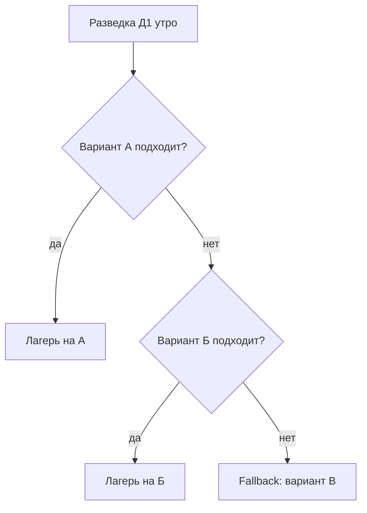

# Маршрут Д1 и варианты места лагеря (А / Б / В)

Даты: **1–5 мая 2026**. Регион **Bory Tucholskie**. До **разведки Д1** финальная точка лагеря **не зафиксирована**.

**Группа разведки** проверяет **А** и **Б** и принимает решение. Если оба не подходят — едем на **вариант В** (fallback).

> **GPS в [README.md](README.md), [logistics.md](logistics.md) § 0 и [todo.md](todo.md)** сейчас соответствуют **варианту В** (запасной точке). После выбора А или Б **обновить координаты на бумаге у медика** и разослать финальный трек/GPX в чат.

## Схема маршрута (карта)

Черновой трек **А → Б → В** на общей карте: **А** — кэмпинг у **Sokole-Kuźnica**; **Б** — «дикость» на берегу озера; **В** — **Zanocuj w lesie** севернее. Красная линия — ручная разметка; по пути на карте видны **Parking leśny, wiata**, переправа **Przeprawa promowa / Sokole-Kuźnica**, **Nogawica PTTK** и др. Ориентир для обсуждения, финальный трек — в навигаторе/GPX.

---

## Сравнение вариантов

| | **А** | **Б** | **В** (fallback) |
|---|---|---|---|
| **GPS** | `53.41857957514094, 17.93018096299734` | `53.42987488241536, 17.875720466446964` | `53.489922, 17.881687` (≈ `53.48987724994465, 17.88360252594775` в [logistics.md](logistics.md)) |
| **Карта** | [Google Maps — А](https://www.google.com/maps?q=53.41857957514094,17.93018096299734) | [Google Maps — Б](https://www.google.com/maps?q=53.42987488241536,17.875720466446964) | [Google Maps — В](https://www.google.com/maps?q=53.489922,17.881687) |
| **Локация** | Берег около **Sokole / Kuźnica** | Глушь, берег озера | Укромное в зоне **Zanocuj w lasie** (Lasy Państwowe) |
| **Легальность** | Бесплатный кэмпинг (по разведке: подтвердить на месте) | **Полностью нелегально** — риск штрафа/конфликта | Легально по правилам программы Zanocuj w lasie (см. [logistics.md](logistics.md) § 0) |
| **Костёр** | Легальные костры (по данным разведки) | Только если группа осознанно идёт на риск; лучше **газ** | **Нельзя** — только обозначенные места / без открытого огня по вашим правилам для этой точки |
| **Соседи** | Возможны | Маловероятны | Зависит от загрузки поляны |
| **Магазин ~8 км** | **Не гарантирован** — после выбора А или Б **перемерить** расстояние до sklepu (см. [logistics.md](logistics.md) § 2) | То же | Ориентир **~8 км** — [карта](https://maps.app.goo.gl/2ZYxbZ9ePUMm5T336) |
| **Вода** | Озеро/берег + закупки | Озеро + закупки | Озеро/лес + закупки; детали при установке |

### Влияние на план

- **Вода** ([logistics.md](logistics.md) § 2): цифра «~8 км до магазина» и маршруты **Д2/Д4** актуальны для **В**; для **А/Б** — пересчитать после решения.
- **Костёр и меню** ([logistics.md](logistics.md) § 4, [menu.md](menu.md)): при **В** — шашлык **Д3** и готовка с упором на костёр **перевести на газ** (мангал/горелки); при **А** — можно опираться на костёр как в базовом плане; при **Б** — минимизировать дым и открытый огонь (**газ** предпочтительнее).
- **Машины** ([logistics.md](logistics.md) § 1): подъезд, разгрузка, парковка — **разные** у А/Б/В; зафиксировать по факту разведки.
- **112** ([logistics.md](logistics.md) § 5): в экстренке называть **фактические** координаты лагеря после выбора.

---

## Протокол разведки (Д1, утро)

### Состав и время

- **Кто:** _уточнить в чате (2–3 человека, желательно с машиной/велом и оффлайн-картой)._
- **Когда:** **утро Д1**, до того как основная велоколонна из Быдгоща **окончательно** уходит в сторону финальной точки — **deadline решения** согласовать с лидером волны (см. [schedule.md](schedule.md)).

### Чеклист на точках А и Б

1. **Занятость:** свободно ли место под **5–6 палаток + большой тент-столовая + навес** ([gear-camp.md](gear-camp.md)).
2. **Соседи (А):** сколько групп, шум, дистанция.
3. **Подъезд:** машина с грузом, велосипеды, грязь после дождя.
4. **Рельеф и тень:** без ям/корней под спальни; ветер к воде.
5. **Вода:** видимый доступ к озеру/ручью; гигиена — по правилам [logistics.md](logistics.md) § 4.
6. **Связь:** сигнал для звонка/чата.
7. **Риски:** сухая трава и ветер (пожар), видимость с дороги/с воды (**Б**).

### Когда вариант «не подходит»

- **А:** нет площади под лагерь **или** несколько шумных соседей **или** явный конфликт/запрет с местными.
- **Б:** высокая заметность, признаки активного обхода (лесничие, таблички, «чистые» поляны под контролем) **или** группа не готова к **нелегальному** сценарию.

---

## Дерево решений

---

## Велотрек: Bydgoszcz → А → Б → В

Порядок точек — **с юга на север** по широте: **А** → **Б** → **В**. Точка сбора велогруппы — **Bydgoszcz Główny** (см. [schedule.md](schedule.md)).

### Ориентиры по ногам (уточнить в Komoot / Google Maps / OsmAnd)

| Нога | Откуда → куда | Ориентир | Примечание |
|---|---|---|---|
| **1** | Bydgoszcz Główny → **А** | **~45–55 км** велом (зависит от выбранной трассы) | Главная дистанция дня; запас воды и света на сумерки |
| **2** | **А** → **Б** | **~10–25 км** | Часто лес/берег — проверить проходимость; оффлайн-карта обязательна |
| **3** | **Б** → **В** | **~15–30 км** | Если А и Б отпали — колонна может идти **напрямую** Bydgoszcz → В по заранее сохранённому треку |

### Точки решения для связи

1. **У варианта А:** разведка пишет в чат **«А — ок / А — нет»** + 1–2 фото. Если **ок** — основная колонна ведёт трек на **А**; если **нет** — эшелон идёт к **Б** (или ждёт второе сообщение).
2. **У варианта Б:** то же: **«Б — ок / Б — нет»**. Если **нет** — все ориентируются на **В** (GPS и парковка — [logistics.md](logistics.md) § 0).

### GPX

Отдельный файл `.gpx` **не приложен** — задача: проложить трек в **Komoot** / **OsmAnd** / Google Maps и выгрузить GPX; пункт в [todo.md](todo.md).

---

## Ссылки

- Расписание и волны Д1: [schedule.md](schedule.md)
- Логистика, вода, мусор: [logistics.md](logistics.md)
- Меню и костёр/гриль: [menu.md](menu.md)
