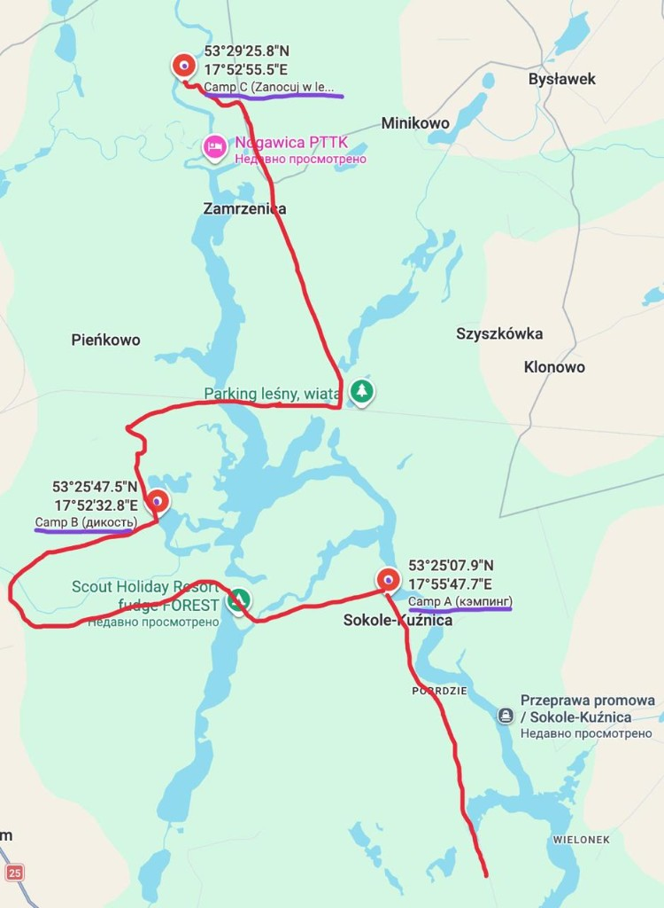

# Маршрут Д1

## Ссылки для навигации

- **Д1 — маршрут велом (Komoot):** [invite-tour/2898633833](https://www.komoot.com/invite-tour/2898633833?code=vno2da-LjSg7RkQiML2dreHQ_w2WbFAi0jNfAvH9JRr0Sn5FGw&ref=wtd&share_token=argI33LTuCK3tgFfSXdXEBiQtEgQoXHsHuJQxs1jvD8PewhzLu)
- **Лагерь А, B и C — список точек в Google Maps:** [maps.app.goo.gl/DnARacFQsH5tuPueA](https://maps.app.goo.gl/DnARacFQsH5tuPueA) 
**Группа разведки** проверяет **A** и **B** и принимает решение. Если оба не подходят — едем на **вариант C** (fallback).

  
## Схема маршрута (карта)

Черновой трек **A → B → C** на общей карте: **A** — кэмпинг у **Sokole-Kuźnica**; **B** — «дикость» на берегу озера; **C** — **Zanocuj w lesie** севернее. Красная линия — ручная разметка; по пути на карте видны **Parking leśny, wiata**, переправа **Przeprawa promowa / Sokole-Kuźnica**, **Nogawica PTTK** и др. Ориентир для обсуждения, финальный трек — в навигаторе/GPX.

---

## Сравнение вариантов

| | **A** | **B** | **C** (fallback) |
|---|---|---|---|
| **GPS** | `53.41857957514094, 17.93018096299734` | `53.42987488241536, 17.875720466446964` | `53.489922, 17.881687` (≈ `53.48987724994465, 17.88360252594775` в [logistics.md](logistics.md)) |
| **Карта** | [Google Maps — A](https://www.google.com/maps?q=53.41857957514094,17.93018096299734) | [Google Maps — B](https://www.google.com/maps?q=53.42987488241536,17.875720466446964) | [Google Maps — C](https://www.google.com/maps?q=53.489922,17.881687) |
| **Локация** | Берег около **Sokole / Kuźnica** | Глушь, берег озера | Укромное в зоне **Zanocuj w lasie** (Lasy Państwowe) |
| **Легальность** | Бесплатный кэмпинг (по разведке: подтвердить на месте) | **Полностью нелегально** — риск штрафа/конфликта | Легально по правилам программы Zanocuj w lasie (см. [logistics.md](logistics.md) § 0) |
| **Костёр** | Легальные костры (по данным разведки) | Только если группа осознанно идёт на риск; лучше **газ** | **Нельзя** — только обозначенные места / без открытого огня по вашим правилам для этой точки |
| **Соседи** | Возможны | Маловероятны | Зависит от загрузки поляны |
| **Магазин ~8 км** | **Не гарантирован** — после выбора A или B **перемерить** расстояние до sklepu (см. [logistics.md](logistics.md) § 2) | То же | Ориентир **~8 км** — [карта](https://maps.app.goo.gl/2ZYxbZ9ePUMm5T336) |
| **Вода** | Озеро/берег + закупки | Озеро + закупки | Озеро/лес + закупки; детали при установке |

### Влияние на план

- **Вода** ([logistics.md](logistics.md) § 2): цифра «~8 км до магазина» и маршруты **Д2/Д4** актуальны для **C**; для **A/B** — пересчитать после решения.
- **Костёр и меню** ([logistics.md](logistics.md) § 4, [menu.md](menu.md)): при **A** и **B** — можно опираться на костёр как в базовом плане; при **C** — минимизировать дым и открытый огонь (**газ** предпочтительнее).
- **Машины** ([logistics.md](logistics.md) § 1): подъезд, разгрузка, парковка — **разные** у A/B/C; зафиксировать по факту разведки.

---

## Протокол разведки (Д1, утро)

### Чеклист на точках A и B

1. **Занятость:** свободно ли место под **5–6 палаток + большой тент-столовая + навес** ([gear-camp.md](gear-camp.md)).
2. **Соседи (А):** сколько групп, шум, дистанция.
3. **Подъезд:** машина с грузом, велосипеды, грязь после дождя.
4. **Рельеф и тень:** без ям/корней под спальни; ветер к воде.
5. **Вода:** видимый доступ к озеру/ручью.
6. **Связь:** сигнал.
7. **Риски:** сухая трава и ветер (пожар), видимость с дороги/с воды (**B**).

### Когда вариант «не подходит»

- **A:** нет площади под лагерь **или** несколько шумных соседей **или** явный конфликт/запрет с местными.
- **B:** высокая заметность, признаки активного обхода (лесничие, таблички, «чистые» поляны под контролем) **или** группа не готова к **нелегальному** сценарию.

---
