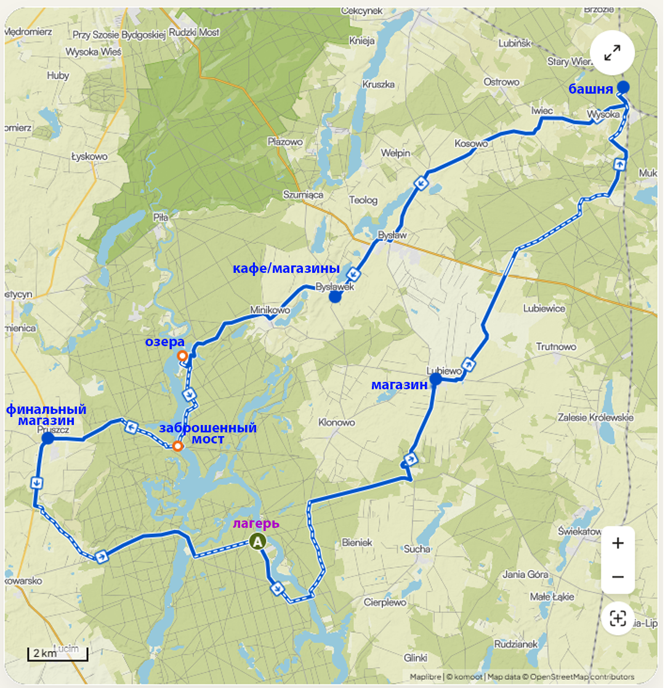
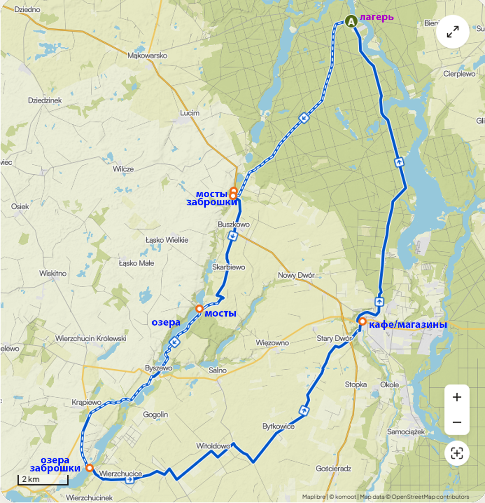

# Маршруты

На текущий момент место лагеря плавающее. Определены три точки:

- **Лагерь А, B и C — список точек в Google Maps:** [maps.app.goo.gl/DnARacFQsH5tuPueA](https://maps.app.goo.gl/DnARacFQsH5tuPueA) 
**Группа разведки** проверяет **A** и **B** и принимает решение. Если оба не подходят — едем на **вариант C** (fallback).

### Сравнение вариантов

| | **A** | **B** | **C** (fallback) |
|---|---|---|---|
| **GPS** | `53.41857957514094, 17.93018096299734` | `53.42987488241536, 17.875720466446964` | `53.489922, 17.881687` (≈ `53.48987724994465, 17.88360252594775` — см. [Логистика](logistics.md), вариант **C**) |
| **Карта** | [Google Maps — A](https://www.google.com/maps?q=53.41857957514094,17.93018096299734) | [Google Maps — B](https://www.google.com/maps?q=53.42987488241536,17.875720466446964) | [Google Maps — C](https://www.google.com/maps?q=53.489922,17.881687) |
| **Локация** | Берег около **Sokole / Kuźnica** | Глушь, берег озера | Укромное в зоне **Zanocuj w lasie** (Lasy Państwowe) |
| **Легальность** | Бесплатный кэмпинг (по разведке: подтвердить на месте) | **Полностью нелегально** — риск штрафа/конфликта | Легально по правилам программы Zanocuj w lasie (см. [Логистика](logistics.md) § 1) |
| **Костёр** | Легальные костры (по данным разведки) | Только если группа осознанно идёт на риск; лучше **газ** | **Нельзя** — только обозначенные места / без открытого огня по вашим правилам для этой точки |
| **Соседи** | Возможны | Маловероятны | Зависит от загрузки поляны |
| **Магазин ~8 км** | **Не гарантирован** — после выбора A или B **перемерить** расстояние до sklepu (см. [Логистика](logistics.md) § 4) | То же | Ориентир **~8 км** — [карта](https://maps.app.goo.gl/2ZYxbZ9ePUMm5T336) |
| **Вода** | Озеро/берег + закупки | Озеро + закупки | Озеро/лес + закупки; детали при установке |

### Влияние на план

  
Влияние на план

- **Вода** ([Логистика](logistics.md) § 4): цифра «~8 км до магазина» и маршруты **Д2/Д4** актуальны для **C**; для **A/B** — пересчитать после решения.
- **Костёр и меню** ([menu.md](menu.md)): при **A** и **B** — можно опираться на костёр как в базовом плане; при **C** — минимизировать дым и открытый огонь (**газ** предпочтительнее), см. § 1 в [Логистика](logistics.md) про правила Zanocuj.
- **Машины** ([Логистика](logistics.md) § 2–3): парковка, подъезд, привоз/вывоз — **разные** у A/B/C; зафиксировать по факту разведки.

---

## Маршрут Д1

  
Маршрут

### Схема маршрута 

- **Д1 — маршрут велом (Komoot):** [invite-tour/2898633833](https://www.komoot.com/invite-tour/2898633833?code=vno2da-LjSg7RkQiML2dreHQ_w2WbFAi0jNfAvH9JRr0Sn5FGw&ref=wtd&share_token=argI33LTuCK3tgFfSXdXEBiQtEgQoXHsHuJQxs1jvD8PewhzLu)

Черновой трек **A → B → C** на общей карте: **A** — кэмпинг у **Sokole-Kuźnica**; **B** — «дикость» на берегу озера; **C** — **Zanocuj w lesie** севернее. Красная линия — ручная разметка; по пути на карте видны **Parking leśny, wiata**, переправа **Przeprawa promowa / Sokole-Kuźnica**, **Nogawica PTTK** и др. Ориентир для обсуждения, финальный трек — в навигаторе/GPX.

### Протокол разведки (Д1, утро)

#### Чеклист на точках A и B

1. **Занятость:** свободно ли место под **5–6 палаток + большой тент-столовая + навес** ([gear-camp.md](gear-camp.md)).
2. **Соседи (А):** сколько групп, шум, дистанция.
3. **Подъезд и парковка:** машина с грузом, велосипеды, грязь после дождя; **где стоянка, метры переноса до палаток** — занести в [Логистика](logistics.md) § 2.
4. **Рельеф и тень:** без ям/корней под спальни; ветер к воде.
5. **Вода:** видимый доступ к озеру/ручью.
6. **Связь:** сигнал.
7. **Риски:** сухая трава и ветер (пожар), видимость с дороги/с воды (**B**).

#### Когда вариант «не подходит»

- **A:** нет площади под лагерь **или** несколько шумных соседей **или** явный конфликт/запрет с местными.
- **B:** высокая заметность, признаки активного обхода (лесничие, таблички, «чистые» поляны под контролем) **или** группа не готова к **нелегальному** сценарию.

## Маршрут Д2

  
Маршрут

### Схема маршрута

- **Д2 — маршрут велом (Komoot):** [tour/2909743014](https://www.komoot.com/tour/2909743014?share_token=aEhHRgTVY4gmqisVD6KElHKqw44GDdWJdDK0emPjn9dLNOKarm&ref=wtd)

| Параметр | Значение |
|---|---|
| **Дистанция** | 67.9 км |
| **Набор высоты** | 290 м ↑ / 290 м ↓ |
| **Время в седле** | 4:42 |
| **Сложность** | Умеренная |

Умеренный велосипедный маршрут. Требуется хорошая физическая форма. Преимущественно асфальтовые покрытия. Подходит для всех уровней. **Включает переправу на пароме.** Есть участок, где езда на велосипеде не разрешена.

### Точки интереса

| км | Точка | Тип |
|---|---|---|
| 48.0 | **Leśny Zakątek** — лесные домики и причал | Место отдыха |
| 51.9 | **Guderian Bridge** — исторический мост | Мост ⚠️ |

> ⚠️ **Guderian Bridge:** сильно заржавевший мост — осторожно с досками и шпалами. Лучше всего перейти пешком.

### Покрытие

| Тип дороги | км | Покрытие | км |
|---|---|---|---|
| Дорога | 37.3 | Асфальт | 41.0 |
| Грунт/тропа | 18.6 | Грунт | 20.7 |
| Велодорожка | 5.63 | Брусчатка | 0.33 |
| Улица | 3.95 | Мощёный | 4.44 |
| Синглтрек | 1.86 | | |
| Паром | <0.1 | | |

## Маршрут Д3

  
Маршрут

### Схема маршрута

- **Д3 — маршрут велом (Komoot):** [tour/2910220803](https://www.komoot.com/tour/2910220803?share_token=acwd9hHIwXjvsPrb0oxoRG3ah0TUu1tFfko7txN8BxkJKghjDy&ref=wtd)

| Параметр | Значение |
|---|---|
| **Дистанция** | 52.6 км |
| **Набор высоты** | 270 м ↑ / 270 м ↓ |
| **Время в седле** | 3:41 |
| **Сложность** | Умеренная |
| **Высшая точка** | 130 м |
| **Низшая точка** | 60 м |

Умеренный велосипедный маршрут. Требуется хорошая физическая форма. Преимущественно асфальтовые покрытия. Подходит для всех уровней. Есть участок, где езда на велосипеде не разрешена.

### Точки интереса

| км | Точка | Тип |
|---|---|---|
| 8.98 | **Krówka River Viaduct** — виадук над рекой Крувка | Мост |
| 9.24 | **Grzmotny Młyn (Donnermühle)** — руины старой мельницы | Исторический объект |
| 14.8 | **Ford on Krówka** — брод / мостик через реку | Река / отдых |
| 23.8 | **Lake Wierzchucińskie Duże** — озеро с хорошими видами | Озеро 🏊 |
| 39.3 | **Koronowo Market Square** — рыночная площадь Коронова | Город / кафе |

> 🏊 **Lake Wierzchucińskie Duże:** хорошие условия для купания летом.

### Покрытие

| Тип дороги | км | Покрытие | км |
|---|---|---|---|
| Дорога | 29.8 | Асфальт | 28.1 |
| Грунт/тропа | 11.9 | Грунт | 16.2 |
| Улица | 8.40 | Мощёный | 5.60 |
| Шоссе | 1.85 | Брусчатка | 1.37 |
| Синглтрек | 0.77 | Уплотнённый гравий | 1.33 |

## Маршрут Д4

  
Маршрут

  
_Coming soon_, юг от лагеря

## Маршрут Д5

  
Маршрут

### Схема маршрута 

  - **Д5 — маршрут велом (Komoot):** [invite-tour/2898634692](https://www.komoot.com/invite-tour/2898634692?code=8d6ufu-qrP4ozMhSkXjX6DaDHhsqg1ToKqwbDWIYcb4KBEv8H0&ref=wtd&share_token=a4RbW0eFVH65LsA8pNhU7ZwB9h42GS24BRIKcg9BvJKXs3fP79)

Возвращение в Быдгощ

